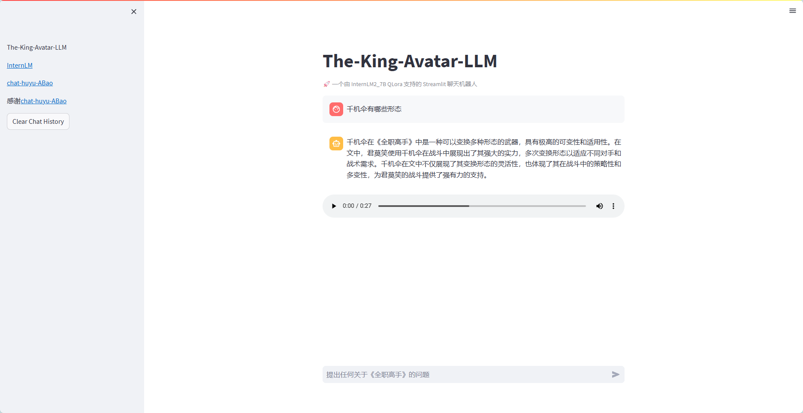

# The-King-Avatar-LLM
全职高手robot 基于 InternLM 实现,感谢[Tutorial](https://github.com/InternLM/Tutorial)

[][license-url] | [][OpenXLab_Model-url] | [][ModelScope-url]

[license-url]: ./LICENSE
[OpenXLab_Model-url]: https://openxlab.org.cn/models/detail/hoo01/chat-huyu-ABao
[ModelScope-url]: https://www.modelscope.cn/models/hooo01/chat-huyu-ABao
## 简介

基于《全职高手》小说原文，并通过大模型进行问答对的生成。
使用InternLM2进行QLora微调+RAG语料库得到。

> 网游荣耀中被誉为教科书级别的顶尖高手叶修，因为种种原因遭到俱乐部的驱逐，离开职业圈的他栖身于一家网吧成了一个小小的网管，但是，拥有十年游戏经验的他，在荣耀新开的第十区重新投入了游戏，带着往昔的回忆和一把由苏沐秋制作的、却因游戏版本更新被迫搁置的银武千机伞，开始了重返巅峰之路。
> 在数字化时代，文学作品的阅读与探索正逐步迈向智能化的新高度。本项目旨在搭建一个创新性的平台，该平台核心功能是将经典及原创小说内容全面融入大规模语言模型的知识库中，通过实现基于 Retrieval-Augmented Generation (RAG) 的问答系统，为用户提供前所未有的互动阅读体验。

## 架构图

## 讲解视频
[微调InternLM大模型，来了解《全职高手》吧！](https://www.bilibili.com/video/BV1dYaoebERQ/?vd_source=6856ef3925c77e098a1a2df5b9634513#reply112908180655895)

## 项目亮点

 1. 可使用语音进行播报

 2. 小说内容上等问题回答表现良好

## 待添加功能

- 图生文💬
- 支持 ASR 语音输入 🎙️
- 支持特定情境下的口语对话📞
- 支持生成数字人视频🦸
- 部署集成 LMDeploy 加速推理🚀

## 快速开始

❕ 暂时仅提供本地部署方法，建议使用30%以上的A100、cuda11.7的配置运行

**1.clone 本项目至本地开发机** 

    git clone https://github.com/shiqiyio/The-King-Avatar-LLM.git

**2.配置环境**

    #创建虚拟环境
    conda create -n quanzhi python=3.10 
    # 激活环境 
    conda activate quanzhi
    # 安装所需依赖（这一步所需时间较长）
    cd The-King-Avatar-LLM
    pip install -r requirements.txt

**3.生成RAG依赖的Chroma数据库**

    python gen_chroma.py

**4.启动(此部分因下载模型需要较长时间)**

    python start.py

> 默认端口和ip为127.0.0.1:7860，如需变更请打开start.py修改 
> 推荐通过vscode进行端口映射，方便快捷！ 
>
> qlora 微调过程

**5.示例效果**

## 微调思路

点击展开详细思路

**1.数据准备** 
数据：《全职高手》小说 

1.使用qwen2_7B生成问答对 
使用本地qwen_7B大模型，提供prompt，批量生成问题，同时传入所生成的问题，并进行回答。 
完整脚本见scripts目录 

2.使用脚本将以上文本问答对，转换为模型微调所需要的类型。 
完整脚本见scripts目录 

通过以上步骤得到符合xtuner微调格式的jsonl数据。 

**2.微调模型** 
xtuner微调工具包的官方教程：   
https://github.com/InternLM/Tutorial/blob/camp2/xtuner/personal_assistant_document.md
https://github.com/InternLM/Tutorial/blob/camp2/data_fine_tuning/data_fine_tuning.md 
1.选择基座模型 
基座模型选择了internlm2-chat-7b。 
2.配置文件修改 
按照教程里的配置文件，对PART1修改，其余部分未动： 
part1改动：

     # Model
    pretrained_model_name_or_path = './model'#修改为基座模型的路径
    use_varlen_attn = False
    # Data
    alpaca_en_path = './data/novel.json'#修改原始数据集路径
    prompt_template = PROMPT_TEMPLATE.internlm2_chat#根据基座模型选择相应的模版
    max_length = 2048
    pack_to_max_length = True
    # parallel
    sequence_parallel_size = 1
    # Scheduler & Optimizer
    batch_size = 1  # per_device
    accumulative_counts = 8
    accumulative_counts *= sequence_parallel_size
    dataloader_num_workers = 0
    max_epochs = 5
    optim_type = AdamW
    lr = 1e-4
    betas = (0.9, 0.999)
    weight_decay = 0
    max_norm = 1  # grad clip
    warmup_ratio = 0.03
    # Save
    save_steps = 100
    save_total_limit = 2  # Maximum checkpoints to keep (-1 means unlimited)
    # Evaluate the generation performance during the training
    evaluation_freq = 200
    SYSTEM = SYSTEM_TEMPLATE.alpaca
    evaluation_inputs = [
    '"介绍一下你自己？', '千机伞有哪些形态？'
    ]
3.继续训练 
在初步训练完成后，模型的问答尚未达到预期效果。采去续训的方式，将`Resume=True`。将初次训练得到的模型作为预训练模型（pretrained_model），进行继续训练，从而实现对数据集更好的理解及问答输出的更好。 
4.局限 
微调后的模型基本上可以应对日常的，但对小说的剧情和人物关系理解方面，其表现仍有待提升。对此，引入RAG（检索增强生成）技术。通过检索知识库信息，辅助模型更准确地回答小说的情节和人物关系问题。

**3.RAG检索增强** 
RAG设计链路参考： 
[https://github.com/InternLM/tutorial/tree/camp1/langchain](https://github.com/InternLM/tutorial/tree/camp1/langchain)
[https://github.com/datawhalechina/llm-universe/tree/main/notebook](https://github.com/datawhalechina/llm-universe/tree/main/notebook) 
1.知识库搭建 将小说txt文件作为语料库。 
2.构建向量数据库 
完整脚本见gen_chroma.py 
其中 

> chunk_size的大小要能包含一个完整的conversation； 因为是长文本txt，分割选择递归分割； 
> 经过测试召回文档的效果，词向量模型最终选择的是shibing624/text2vec-base-chinese，使用huggingface导入； 
> 使用chroma作为向量数据库，运行即可得到持久化的向量数据库，无需重复构建。
> 
> `#创建文本分割器实例` `text_splitter =
> RecursiveCharacterTextSplitter(chunk_size=600, chunk_overlap=100)`
> `embedding_function =
> HuggingFaceEmbeddings(model_name="shibing624/text2vec-base-chinese")`
> `persist_directory ='/root/thisis/chroma'#根据下载模型的路径调整，建议写绝对路径`

3.接入LangChain框架 
完整脚本见llm.py 
4.构建检索问答链 
完整脚本见ragchat.py 
在prompt template引导模型使用外部增强的知识库

        template = """
        **Context**（背景）：
        你是一个由十七专门训练的《全职高手》小说问答模型。可以提供准确且详细的解答，帮助用户深入了解这部小说的角色、情节和背景。
        
        **Objective**（目标）：
        回答有关《全职高手》的问题，提供有价值的见解，并确保回答基于提供的上下文信息。
        
        **Structure**（结构）：
        1. 理解问题及其背景。
        2. 查阅提供的上下文信息。
        3. 使用上下文信息优先回答问题。
        4. 如果上下文信息不足，再使用模型的通用知识。
        
        **Task**（任务）：
        回答以下问题，确保回答基于上下文信息，并在必要时参考其他知识。
        
        **Action**（行动）：
        详细阅读问题，并结合上下文信息提供准确的回答。
        
        **Result**（结果）：
        提供一个详细、准确且基于上下文的信息，以解答问题并满足用户的需求。
        
        问题: {question}
        
        上下文信息：
        ···
        {context}
        ···
        
        请根据上述框架回答问题。
    """

5.接入streamlit 
见app.py和start.py 

 

## 致谢

 - [书生浦语](https://internlm.intern-ai.org.cn/)提供的平台及算力资源 
欢迎大家报名新一期的书生浦语大模型实战营！[第三期报名](https://github.com/InternLM/Tutorial)
 - [chat-沪语-阿宝](https://github.com/hoo01/chat-huyu-ABao)

